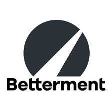
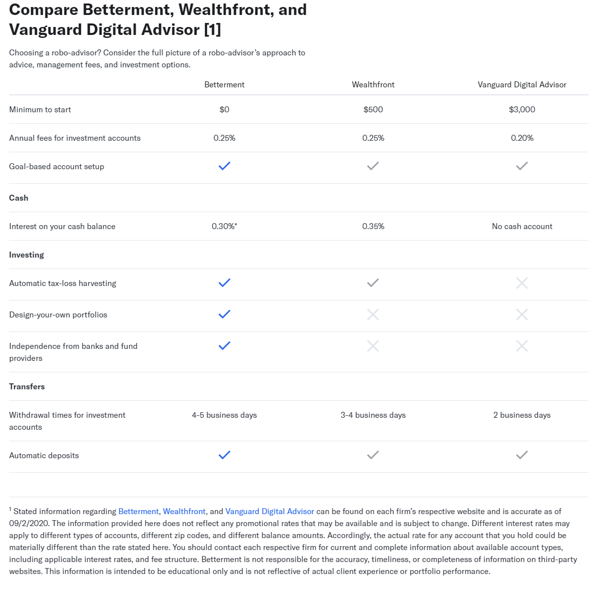
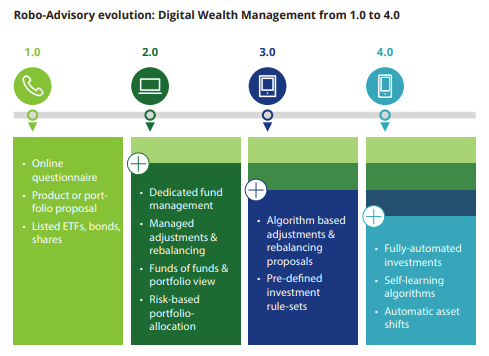
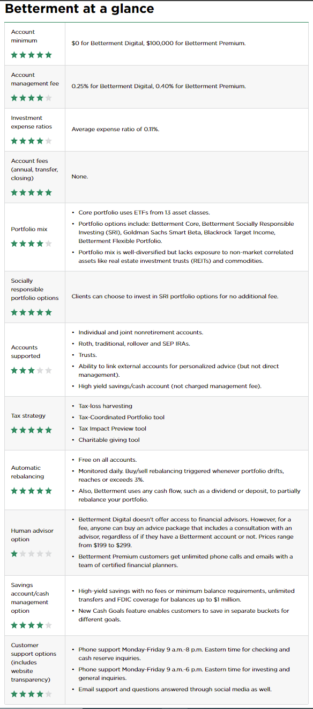

# Betterment- A Financial Advisory Company

## Overview and Origin

* Name of company: 

    

* When was the company incorporated?
    - 2008: Founded in New York City.
    - January 29, 2008: Betterment Holdings, Inc., the parent company, was established in Delaware.
    - April 7, 2009: Betterment, LLC was established as a Delaware corporation.

* Who are the founders of the company?
    - Jon Stein, a Columbia Business School MBA graduate, and 
    - Eli Broverman, a lawyer out of NYU School of Law.

* How did the idea for the company (or project) come about?
    >By Jon Stein
    >
    >>"I started Betterment when it occurred to me that the concepts I’d learned while studying behavioral economics and biology in college could actually apply to the many mistakes I was making in managing my own investments.
    While economics is good at explaining the world at a macro level, it fails to explain human behavior. At a micro level, economics assumes that humans are rational, and they’re far from rational. Especially when it comes to their money; people heavily discount the future, they withdraw when markets crash, and it’s because our emotions drive our decisions."

* How is the company funded? How much funding have they received?
    - Betterment received Series A round funding from Bessemer Venture Partners in December 2010. 
    - By October 2012, Menlo Ventures provided Series B funding along with Bessemer Venture Partners and Anthemis Group.
    - By 2012, the company established product offerings, such as IRAs, auto-deposit, auto-rebalancing, and goal-based investing advice.

## Business Activities:

* What specific financial problem is the company or project trying to solve?
    >By Jon Stein
    >
    >>"Somewhere in between their bank and their investment manager, Americans lose out on the most important element of finance: **Saving their cash.**
    >>
    >>Make no mistake; your savings is what matters. It’s what matters when paying down debt. It’s what matters for starting a business. It’s what matters for securing a healthy retirement.
    >>
    >>And yet, banks typically don’t help you become a better saver; they encourage holding cash at the ready for spending and sell you loans when you don’t have enough. Meanwhile, most investment managers pay little attention to your saving; they focus on larger deposits, like retirement money withheld from a paycheck. Between working with a bank and an investment manager, we, as a nation, fail to save enough for the things we need.
    >>
    >>## The everyday American deserves a cash advisor."

* Who is the company's intended customer?  Is there any information about the market size of this set of customers?
What solution does this company offer that their competitors do not or cannot offer? (What is the unfair advantage they utilize?)
    - As of March 6, 2020, per [this article][1], Betterment had more than 500,000 accounts, and $22 billion AUM
    - Average account size has also grown to $44,000, tripling what it was in 2012.
    - The robo-advice market is expected to reach $1.26 trillion by the end of 2023, up from $283 billion in 2019, according to the research.
    - Betterment is better [because][2]

    

[1]: <https://www.investmentnews.com/betterment-grows-500k-accounts-189575> "Investmentnews"
[2]: <https://www.betterment.com/category/robo-advisor/> "Betterment"

* Which technologies are they currently using, and how are they implementing them? (This may take a little bit of sleuthing–– you may want to search the company’s engineering blog or use sites like Stackshare to find this information.)
    >[Technologies used at Betterment][3]

[3]: <https://stackshare.io/betterment/betterment> "Betterment Tech Stacks"

## Landscape:

* What domain of the financial industry is the company in?
    - robo-advising and cash management services, and [more][4]

[4]: <https://www.betterment.com/roadmap/> "Betterment Product Roadmap"

* What have been the major trends and innovations of this domain over the last 5-10 years?
    - Delloite has sumemd it up [here][5]

    

[5]: <https://www2.deloitte.com/content/dam/Deloitte/de/Documents/financial-services/Deloitte-Robo-safe.pdf> "Robo"

* What are the other major companies in this domain?
    - Per [craft.co][6], Betterment competes with SigFig, Acorns, WealthFront, and Ellevest.

[6]: <https://craft.co/betterment/competitors> "Competetion"

## Results

* What has been the business impact of this company so far?
    > *"Betterment is a clear leader among robo-advisors. The company offers two service options: Betterment Digital, its legacy offering, has no account minimum and charges 0.25% of assets under management annually. Betterment Premium provides unlimited phone access to certified financial planners for a 0.40% fee and a $100,000 account minimum."*
    >
    >>[Nerdwallet][7] has has reviewed **Where Betterment shines**.

[7]: <https://www.nerdwallet.com/reviews/investing/advisors/betterment?scrollTo=full-review-scroll-targets> "Nerdwallet on betterment"

* What are some of the core metrics that companies in this domain use to measure success? How is your company performing, based on these metrics?

    

* How is your company performing relative to competitors in the same domain?

## Recommendations

* If you were to advise the company, what products or services would you suggest they offer? (This could be something that a competitor offers, or use your imagination!)

* Why do you think that offering this product or service would benefit the company?

* What technologies would this additional product or service utilize?

* Why are these technologies appropriate for your solution?

## References

* https://en.wikipedia.org/wiki/Betterment_(company)
* https://www.betterment.com/resources/the-history-of-betterment/
* https://www.betterment.com/resources/how-banks-fail-consumers-savings/
* https://www.investmentnews.com/betterment-grows-500k-accounts-189575
* https://www.betterment.com/category/robo-advisor/
* https://www.investmentnews.com/betterment-grows-500k-accounts-189575
* https://stackshare.io/betterment/betterment
* https://www.betterment.com/roadmap/
* https://www2.deloitte.com/content/dam/Deloitte/de/Documents/financial-services/Deloitte-Robo-safe.pdf
* https://www.nerdwallet.com/reviews/investing/advisors/betterment?scrollTo=full-review-scroll-target
 

